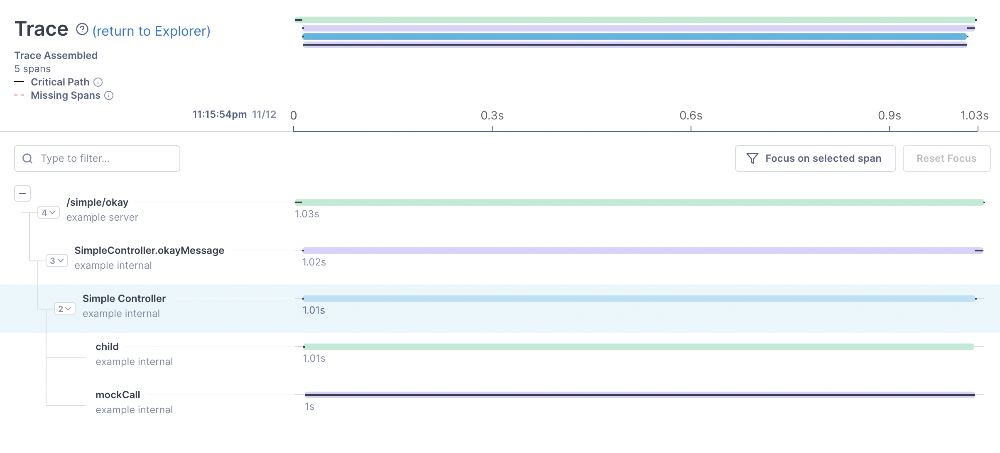

### OpenTelemetry Examples
This repository includes examples for **manual** instrumentation in [OpenTelemetry](https://opentelemetry.io/) using [Lightstep](https://lightstep.com/).

1. Simple Trace
2. Error Handling
3. WithSpan annotation
4. Spans in Reactive Streams
5. Context Propagation with external service
6. Context Propagation in SAGA based services (using Kafka)

### Auto Instrumentation
1. Build the code so that you have a .jar file with you. 
2. Get the latest version of the distro and run it with your code
    ```shell
    curl -L -O https://github.com/lightstep/otel-launcher-java/releases/latest/download/lightstep-opentelemetry-javaagent.jar
    ```
3. Run it with your target/*.jar
    ```shell
    java -javaagent:lightstep-opentelemetry-javaagent.jar -jar target/*.jar
    ```

If you have multiple environments for java and use [jenv](https://github.com/jenv/jenv) change the env to the runtime on your shell before running the above command.
```shell
Exception in thread "main" java.lang.UnsupportedClassVersionError: com/chaks/opentelemetry/examples/ExamplesApplication has been compiled by a more recent version of the Java Runtime (class file version 55.0), this version of the Java Runtime only recognizes class file versions up to 52.0
```

The output for the `simple/okay` controller would look like this.


### Thoughts on OpenTelemetry
1. It really solves for observability. I am able to link multiple services and see my packet go through them and find issues/bottlenecks.
2. `Events` really solve for logs and distributed logs don't make sense for me. I need to see the logs for the packets that are giving me an issue and with this I am able to tie all those logs to the distributed task that I am working with. And all of these constructs are provided out of the box. 
3. `Census` and aggregation can solve for any aggregation related problem statements that we encounter.  
4. [Context Propagation](https://opentelemetry.io/docs/java/manual_instrumentation/#context-propagation) is still something that I don't feel comfortable about.
5. The concepts of Spec => SDK => API => Frameworks and Libraries is one of the best abstractions I have seen. It is similar to how the android ecosystem works Spec => Hardware => SDK => API => Apps. This allows for easier evolution of individual layers.
6. The community is small and has not reached critical mass. But since they are already have good people at high places, they will be able to add specs for context propagation as a valid W3C header and it will be a huge win for them. It is only a matter of time that this tech will reach critical mass and host of startups will start building the ecosystem around it. It seems like a very safe technology to bet on. [Thoughtworks keeps at the Trial Phase](https://www.thoughtworks.com/en-in/radar/platforms/opentelemetry) which is one step away from adoption. 